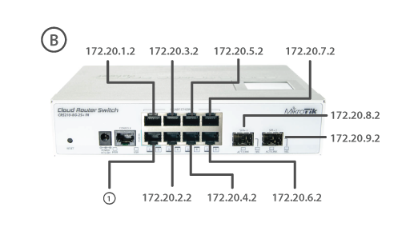

# KORUZA packet loss testing at 10Gbps

KORUZA 1.0 10G version enables across-the street connectivity at 10Gbps rates, however connecting at these rates is somewhat more challenging or typically expensive. We have devised a low-cost setup for testing it and demonstrate some connectivity options.

The key difference between KORUZA 1G and 10G versions is the network port configuration, both having one 100Mbps ethernet port with PoE for powering and management and 1Gbps ethernet port or SFP socket respectively. Connecting to 10G unit can thus be done either with SFP modules and fiber optical cable or using SFP-SFP direct attach cables at short distances. They come in two option, passive and active, the difference only being in their maximal length. Based on our experience passive direct attach cables are a better option if feasible at the desired distance.

Testing a 10Gbps network link at low-cost is rather challenging since even low-cost devices such as Mikrotik CRS210-8G-2S+IN http://routerboard.com/CRS210-8G-2SplusIN featuring two 10G ports can not generate 10Gbps of real data. The link can be established at that speed, however routing and packet generation are limited to lower speeds. For example using the Mikrotik Bandwidth test on this device will produce a traffic peak of about 450Mbps. This may be sufficient for studying packet loss over a 10G link, however noting that the true BER can not be determined this way. It is important to note as well that some packet loss may be generated in the routers itself if we try to push too much data, especially when using UDP modes.

To test packet loss via KORUZA optical link we have developed two options. One based on openwrt and TP-Link WDR4300ND routers using neatmeasured https://github.com/wlanslovenija/netmeasured utility to measure packet loss a a millisecond interval rate. The second option is using Mikrotik CRS210-8G-2S+IN device with 10G ports and testing packet loss or throughput at about 100ms intervals.

Due to the design of KORUZA and SFP modules themselves with a hysteresis link disable threshold, we can observe the module breaking the communication prior to any significant packet loss appearing on the link, such that it does not operate in the lossy range.

A key hardware improvement required for 10G operation was removing the media converter and creating a SFP back to back extension circuit. The 1G version is using a SATA cable which suffices at that speed, however for 10Gbps a better solution was required. Thus a 10G SFP socket board has been designed using coaxial cables for high speed connection. In this configuration operation up to 40Gbps should be supported.

# Instructions
To replicate the testing setup you require:
 * 2pcs Mikrotik CRS210-8G-2S+IN
 * 1pc WiFi router with 4 LAN ports
 * 1pc KORUZA 10G link
 * 4pcs 10G SFP+ module and 2pcs suitable fibre cable (alternatively SFP+ direct attach cables)
 * ethernet cables
 * PoE 24V injectors
 
WiFi router is the DHCP master giving addresses to KORUZA units and Mikrotik test rotuers, such that we can access all of them from a single computer. There are two config files in this repository, namely mikrotik-test-1a and mikrotik-test-1b. Upload them to each device and then connect as shown. You can access their web interface via IP addresses allocated to them by WiFi router, look up the DHCP client list to get them.

Connect KORUZA units with Mikrotik test routers. Establish the KORUZA link as shown in KORUZA user manual. Once the RX power for 10G units is greater then 15dBm, there should be no packet loss on the link.

Packet loss and other tests can be performed via Mikrotik web interface, such that you choose Tools/Ping and ping the opposite Mikrotik device. Note that each port has a different IP address, so you can use the device to test a number of links simultaneously, but both ends of the link need to be in the same subnet.

For example, when KORUZA units are connected to test routers on SFP+ port 1 on both units, you can from Mikrotik-test-1a ping Mikrotik-test-1b with IP 172.20.8.20

Note that if you do a bandwidth test, these Mikrotik routers can only generate up to 450Mbps.

[
[
[
[
